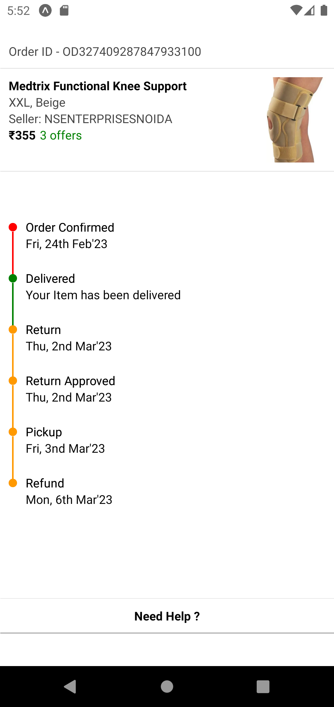

# Mazic Order Tracking UI

### Props

- **data:** *(array of objects)* each object represent one node
    - **title:** *(string)* key of object. Specifies title of each node
    - **subTitle:** *(string)* key of obhect. Specifies sub title of each node
    - **activeColor** optional active color for node
    - **inactiveColor** optional inactive color for node

### [Watch On Youtube](https://youtu.be/Pf4e32QDyY8)

### Sample Image



### Example

```js
import { MazicOrderTrackingUi } from "react-native-mazic-components";
import { View, Text, StyleSheet, Image } from "react-native";
export default function App() {
  const data = [
    {
      activeColor: "red",
      inactiveColor: "rgba(20,20,20,0.3)",
      title: "Order Confirmed",
      subTitle: "Fri, 24th Feb'23",
    },
    {
      activeColor: "green",
      inactiveColor: "rgba(20,20,20,0.3)",
      title: "Delivered",
      subTitle: "Your Item has been delivered",
    },
    {
      activeColor: "#ff9900",
      inactiveColor: "rgba(20,20,20,0.3)",
      title: "Return",
      subTitle: "Thu, 2nd Mar'23",
    },
    {
      activeColor: "#ff9900",
      inactiveColor: "rgba(20,20,20,0.3)",
      title: "Return Approved",
      subTitle: "Thu, 2nd Mar'23",
    },
    {
      activeColor: "#ff9900",
      inactiveColor: "rgba(20,20,20,0.3)",
      title: "Pickup",
      subTitle: "Fri, 3nd Mar'23",
    },
    {
      activeColor: "#ff9900",
      inactiveColor: "rgba(20,20,20,0.3)",
      title: "Refund",
      subTitle: "Mon, 6th Mar'23",
    },
  ];

  return (
    <View style={{ marginTop: 50, marginHorizontal: 10 }}>
      <Text style={styles.normalText}>Order ID - OD327409287847933100</Text>
      <View
        style={{
          height: 1,
          backgroundColor: "rgba(20,20,20,0.1)",
          marginVertical: 10,
          marginHorizontal: -10,
        }}
      ></View>
      <View style={{ flexDirection: "row" }}>
        <View style={{ flex: 1 }}>
          <Text style={styles.titleText}>Medtrix Functional Knee Support</Text>
          <Text style={styles.normalText}>XXL, Beige</Text>
          <Text style={styles.normalText}>Seller: NSENTERPRISESNOIDA</Text>
          <View style={{ flexDirection: "row" }}>
            <Text style={styles.titleText}>₹355</Text>
            <Text style={styles.offerText}>3 offers</Text>
          </View>
        </View>
        <Image
          source={{
            uri: "https://firebasestorage.googleapis.com/v0/b/mymasai-school.appspot.com/o/TrackingUI%2Fknee_support.webp?alt=media&token=8d888f7e-8991-4f2c-9a1c-30c090a3064f",
          }}
          style={{ width: 70, height: 100 }}
        />
      </View>
      <View
        style={{
          height: 1,
          backgroundColor: "rgba(20,20,20,0.1)",
          marginVertical: 10,
          marginHorizontal: -10,
        }}
      ></View>
      <MazicOrderTrackingUi
        data={data}
        style={{
          marginVertical: 50,
          backgroundColor: "red",
          marginHorizontal: -10,
          padding: 10,
          borderWidth: 5,
          borderColor: "black",
        }}
      />
      <View
        style={{
          height: 1,
          backgroundColor: "rgba(20,20,20,0.1)",
          marginVertical: 10,
          marginHorizontal: -10,
        }}
      ></View>
      <Text style={[styles.titleText, { textAlign: "center" }]}>
        Need Help ?
      </Text>
      <View
        style={{
          height: 1,
          backgroundColor: "rgba(20,20,20,0.4)",
          marginVertical: 10,
          marginHorizontal: -10,
        }}
      ></View>
    </View>
  );
}

const styles = StyleSheet.create({
  normalText: {
    color: "rgba(20,20,20,0.8)",
  },
  titleText: {
    fontWeight: "bold",
  },
  offerText: {
    color: "green",
    marginLeft: 5,
  },
});

```
