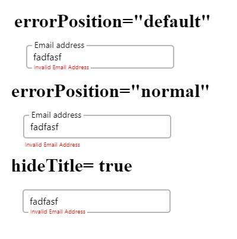

# Mazic Text Input



### Props

-  **value:** *(string)*
-  **setValue:** *(Function)*
-  **err?:** *(boolean)*
-  **setErr?:** *(Function)*
-  **placeholder?:** *(string)*
-  **validation?:** *(string[])* Details mentioned after example
-  **max?:** *(number)*
-  **min?:** *(number)*
-  **m?:** *(number)* Margin value
-  **mb?:** *(number)* Margin bottom, default is 20
-  **mt?:** *(number)* Margin Top
-  **ml?:** *(number)* Margin Left
-  **mr?:** *(number)* Margin Right
-  **h?:** *(number)* Height. Default is 40
-  **w?:** *(number)* Width. Default is 250
-  **fct?:** *(string)* Font color title
-  **fci?:** *(string)* Font color input
-  **fce?:** *(string)* Font color error
-  **bgct?:** *(string)* Background color title. Same as bgci if not provided
-  **bgci?:** *(string)* Background color input. Default white
-  **bgce?:** *(string)* Background color error. Same as bgci if not provided
-  **fst?:** *(number)* Font Size title, default is 12
-  **fsi?:** *(number)* Font size input, default is 16
-  **fse?:** *(number)* Font size error, default is 10
-  **title?:** *(string)* Same as placeholder if not mentioned
-  **hideTitle?:** *(boolean)* if true title will be hiden. Default is false
-  **errorPosition?:** *(string)* If normal then error will be displayed below input. Otherwise will overlap the botom border as shown in image.
-  **style?:** If you want to modify any other style except the mentioned then use the default style option.

```
Note: Props with `?` are optional props.
```

### Uses Example 

[CodeSandbox Link of working example](https://codesandbox.io/s/mazic-component-example-wkjvbj?file=/src/App.js)

```js
function anyFunction(){
  const [email, setEmail] = useState('');
  const [emailErr, setEmailErr] = useState(true);
  const [mobile, setMobile] = useState('');
  const [mobErr, setMobErr] = useState(true);
  .......
  .......
  return(<View>
        <MazicTextInput
        value={mobile}
        setValue={setMobile}
        err={mobErr}
        setErr={setMobErr}
        placeholder="Mobile No"
        validation={['no-space', 'only-digits', 'min', 'max']}
        min={10}
        max={10}
      />
      <MazicTextInput
        value={email}
        setValue={setEmail}
        err={emailErr}
        setErr={setEmailErr}
        placeholder="Email"
        validation={['valid-email']}
      />
      <MazicButton
        title={'SUBMIT'}
        onPressFn={onSubmitPress}
        disabled={emailErr || mobErr}
      />
  </View>)
}
```
In the above example at the beginning we have set the error to true. Means we are assuming that the text input has not passed validation. The validations that you want to execute can be mentioned in an array as in example.

### Validation Details

- **no-space:** the input can not contain spaces
- **only-digits:** the input can contain only numbers from 0 to 9
- **only-letters:** the input can not contain any letters from 0 to 9
- **max:** the maximum number of letters to be accepted as input. For this you have to pass value for `max` other wise the default max value is 30.
- **min:** the minimum number of letters to be accepted as input. For this you have to pass value for `min` other wise the default min value is 3.
- **valid-email:** the input should be a valid email address

